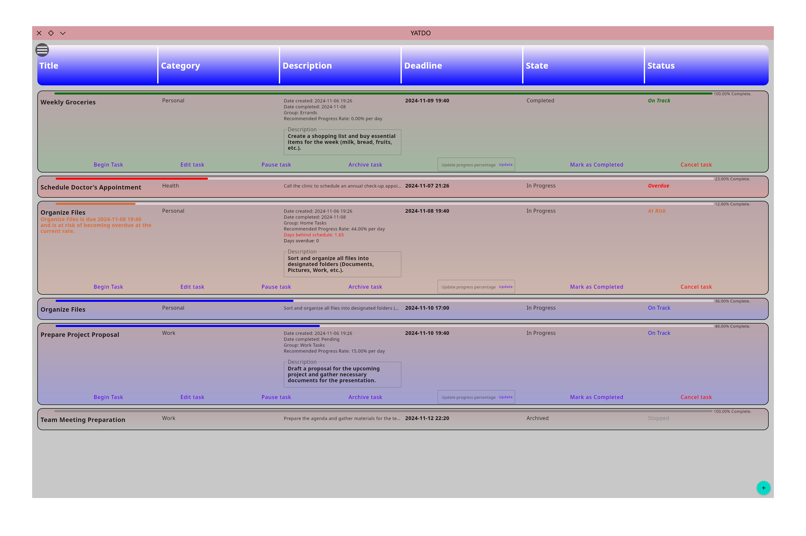

# YATDO - Yet Another TODO App

YATDO (Yet Another TODO App) is a Kotlin-based Linux desktop application designed to help users manage and organize tasks effectively. This app offers robust features for task management, including task creation, editing, categorization, prioritization, and scheduling, along with custom notifications and a sleek user interface.

## Features

- **Task Management**: Create, edit, and delete tasks with specific titles, descriptions, categories, and deadlines.
- **Task Prioritization**: Set task priority levels (Low, Normal, High, Urgent) for better organization.
- **Progress Tracking**: Monitor task progress with calculated daily requirements and estimated completion time.
- **Scheduling & Reminders**: Define deadlines and receive notifications if tasks are at risk or overdue.
- **Data Persistence**: Store tasks in a local database, with support for backup and restore functionality.
- **User Interface**: Intuitive and interactive UI built using Jetpack Compose with smooth animations and transitions.
- **Notifications**: Custom notifications using `libnotify` for task status updates and reminders.

## Home Screen
Displays the list of all tasks with their current status and categories.




### Task Creation
Form to create or edit tasks, with options to set priority, deadline, and category.


## Installation

1. **Clone the Repository**
   ```bash
   git clone https://github.com/YOUR_USERNAME/YATDO.git
   cd YATDO
   ```

2. **Build the Project**
   Use your IDE or build directly with Gradle:
   ```bash
   ./gradlew build
   ```

3. **Run the Application**
   ```bash
   ./gradlew run
   ```

## Usage

1. **Create Tasks**: Click on the floating action button to add new tasks. Provide details such as title, description, category, priority, and deadline.
2. **Edit or Delete Tasks**: Select any task to edit its details or delete it if no longer needed.
3. **Notifications**: The app provides alerts if tasks are at risk of becoming overdue or have already missed their deadlines.
4. **View Archived Tasks**: Toggle the visibility of archived tasks using the settings.
5. **Backup and Restore**: Periodically back up your task database and restore it as needed.

## Code Structure

- **Main Components**:
    - `ContentProvider`: Manages and provides task data.
    - `ContentRepository`: Interfaces with the `Database` to perform CRUD operations on tasks.
    - `NativeSysCalls`: Handles native system calls for notifications.
    - `Database`: Local storage for tasks with support for backup and restore.
    - **UI Components**:
        - `Home`: Main UI container that displays the task list.
        - `TaskComponent`: Shows individual task details, including title, description, and deadlines.
        - `TaskCreator`: UI form for creating and editing tasks.

## Contributing

Feel free to fork this repository and contribute by submitting a pull request. Make sure to include comprehensive descriptions of the changes you propose.

## License

This project is licensed under the GPL 3 License. See the LICENSE file for more details.
